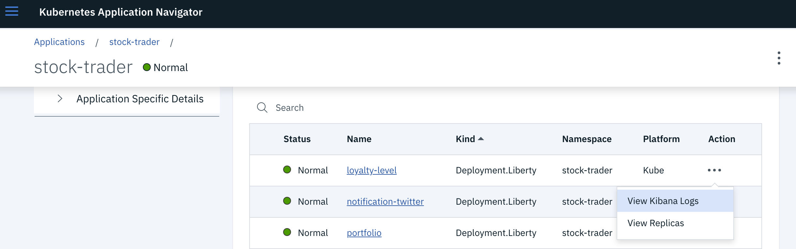

# Viewing Logs for Liberty Deployments

The OpenLiberty operator provides a dashboard for viewing log data with Kibana.
kAppNav includes pre-built a prebuilt action to open this dashboard view for the selected Liberty Deployment resource.  

## View Logs with Kibana 

The following screenshot shows how to access and launch the Kibana log view for a Liberty deployment.  Note this dashboard is
designed to show logs for all pods belonging to the same Liberty Deployment resource.

